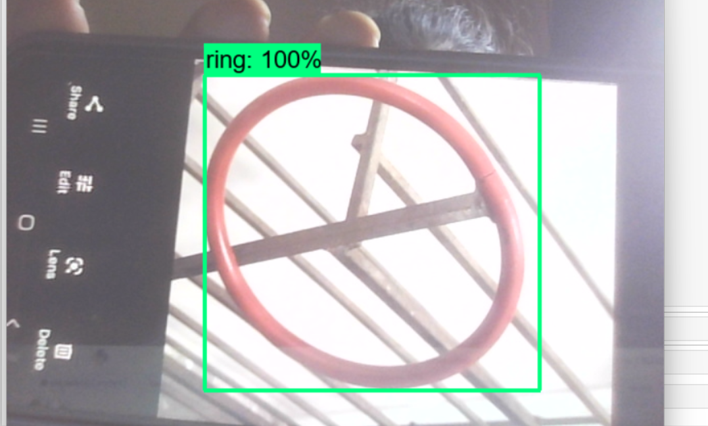

# Ring Detction Using Tensorflow

Welcome to the ring detction model repository!

## Table of Contents

- [Introduction](#introduction)
- [Features](#features)
- [Installation](#installation)
- [Demo](#demo)
- [Contributing](#contributing)

## Introduction

This repository contains the code and resources for an ring detection model created using TensorFlow. The model is trained to detect rings within images and draw bounding boxes around them, indicating their locations. The primary goal of this project is to provide a starting point for anyone interested in building their own object detection models or understanding how such models work.

## Features

- **Object Detection:** The model can detect multiple rings within an image and draw bounding boxes around them.
- **Customizable:** You can fine-tune the model on your own dataset and adapt it to your specific use case.
- **Easy-to-Use:** With detailed instructions, setting up and using the model is straightforward.

## Installation
Install the required dependencies:
```bash
pip install -r requirements.txt
```
## Demo
The following image shows the output of the model:


## Contributing
Contributions to this project are welcome! Feel free to open issues and submit pull requests.


